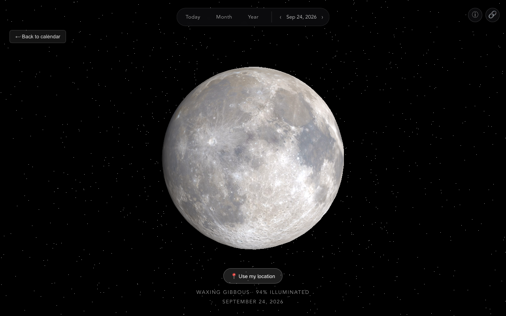
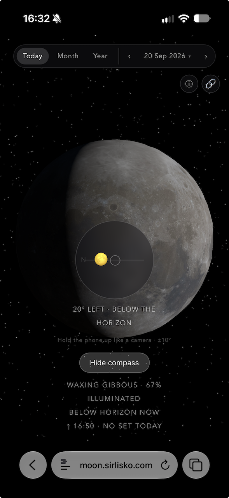
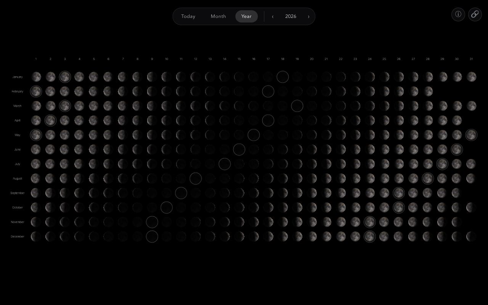

# Moon

A live 3D model of the Moon, showing its real phase and position as seen from your location. Plus a calendar with every day's moon phase, like a printed lunar calendar.



## What it does

- **Today**: a live 3D moon, using real NASA images, showing today's actual phase and its slight wobble (called libration). If you share your location, it also shows how high the Moon is and which way to look, plus moonrise and moonset times. The crescent even tilts to match what you would really see looking up from where you are.
- **Point me at the Moon**: on a phone, once you have shared your location, tap “🧭 Point me at the Moon” on the Today view. A small viewfinder shows where the Moon is compared to where the back of your phone is pointing: turn and tilt until the marker sits in the middle and you are looking right at it. It uses the phone's compass, so it reads magnetic north and is good to about 10 degrees — enough to find the Moon, not to aim a telescope. If the Moon is below the horizon, it only tells you which way to turn.
- **Month / Year**: a calendar grid of every day's moon. Each one is its own lit 3D sphere, not a flat icon. New and full moon days get a small ring marker (off by default, you can turn it on). Click any day, or use Tab, arrow keys, and Enter, to open it.
- **Any date**: click a calendar day, or use the ‹ › buttons on any view, to see the Moon as it looked, or will look, on that date, from your location. It opens at the Moon's highest point that day (or 9 PM without a location), and a slider picks any other time. The ← and → keys step a day.





Your location and compass readings stay in your browser. They are only used to compute the render and are never sent anywhere.

## Running it

Requires [pnpm](https://pnpm.io).

```bash
pnpm install
pnpm dev        # start the dev server
pnpm build      # production build to dist/
pnpm preview    # preview the production build
```

## Testing

```bash
pnpm test       # Playwright end-to-end smoke suite
pnpm test:unit  # Vitest unit tests for the astronomy math
```

## How it's built

The astronomy math comes from [`astronomy-engine`](https://github.com/cosinekitty/astronomy).

## Credits

- Moon images: [NASA SVS CGI Moon Kit](https://svs.gsfc.nasa.gov/4720). Color and height data from NASA's Lunar Reconnaissance Orbiter.
- Astronomy math: [astronomy-engine](https://github.com/cosinekitty/astronomy) by Don Cross.
- 3D rendering: [Three.js](https://threejs.org).
